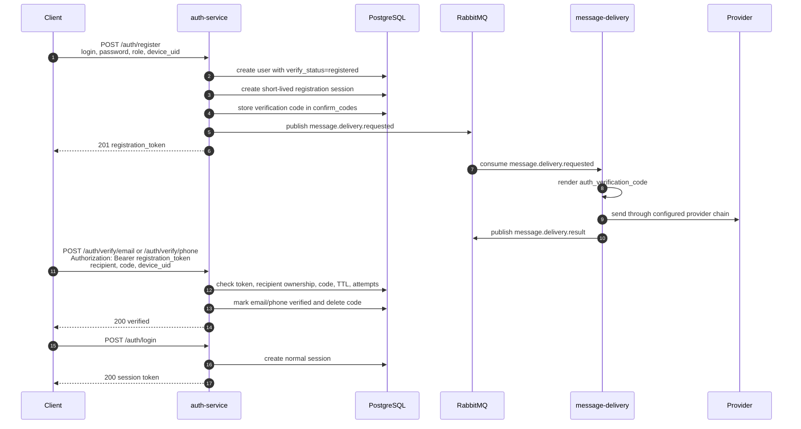

# auth-service

A lightweight authentication and authorization microservice built with Go and Gin. Supports JWT session tokens, email/phone 2FA, API key management, rate limiting, and RabbitMQ-based message delivery requests.

## Features

- Registration and login via email or phone
- Two-factor authentication (2FA) with verification codes
- JWT session tokens with configurable TTL
- API key management (admin/system roles)
- Redis-backed rate limiting and session cache
- PostgreSQL for persistent storage with auto-migrations
- RabbitMQ producer for generic `message.delivery.requested` events
- Swagger/OpenAPI documentation

## API Endpoints

| Method | Path | Auth | Description |
|--------|------|------|-------------|
| GET | `/health` | — | Service health check |
| POST | `/auth/register` | — | Register a new user |
| POST | `/auth/login` | — | Login with email/phone + password |
| POST | `/auth/logout` | Bearer | Logout and invalidate token |
| POST | `/auth/send-code` | Bearer registration/session token | Send verification code |
| POST | `/auth/verify/email` | Bearer registration/session token | Verify email address |
| POST | `/auth/verify/phone` | Bearer registration/session token | Verify phone number |
| POST | `/auth/login/verify-2fa` | — | Complete 2FA login |
| GET | `/auth/me` | Bearer | Get current user info |
| POST | `/auth/api-keys` | Bearer + admin/system | Create API key |
| GET | `/auth/api-keys` | Bearer + admin/system | List API keys |
| DELETE | `/auth/api-keys/:id` | Bearer + admin/system | Revoke API key |
| GET | `/swagger/*` | — | Swagger UI |

## Getting Started

### Prerequisites

- Go 1.22+
- PostgreSQL 15+
- Redis 7+
- RabbitMQ (optional, for email/SMS notifications)

### Configuration

Copy the example config and edit it:

```bash
cp auth-service.example.json auth-service.json
# Edit auth-service.json with your settings
```

### Run locally

```bash
make run
```

This uses `auth-service.example.json` as the config by default.

To use a custom config:

```bash
go run ./cmd/main.go --config /path/to/config.json
```

## Message Delivery

`auth-service` does not send email, Telegram, WhatsApp or SMS messages directly. Its responsibility is to prove that a user controls an email address or phone number:

- validate auth request;
- generate and store verification/reset code;
- apply TTL/rate-limit/attempt rules;
- publish a generic delivery request to RabbitMQ.

Actual provider orchestration is handled by a separate `message-delivery` service.

### Verification tokens

Verification endpoints use Bearer tokens, but the token type depends on the flow.

| Flow | Token |
|---|---|
| Registration verification | `registration_token` returned by `/auth/register`. |
| Authenticated email/phone verification | Normal session token returned by `/auth/login`. |
| Password reset request | No Bearer token. The endpoint intentionally avoids account enumeration. |
| 2FA login verify | No Bearer token. The user is not fully authenticated yet. |

`registration_token` is a short-lived session with `auth_type=registration`. It exists only to authenticate verification calls after registration. The client must send it as:

```http
Authorization: Bearer <registration_token>
```

The same header format is used for normal session tokens after login.

### Registration verification flow



Important details:

- `/auth/register` returns `registration_token`; it is not a full login session.
- `/auth/send-code` can be called with either `registration_token` or a normal session token.
- `/auth/verify/email` and `/auth/verify/phone` require a token so the service can check that the recipient belongs to the current user.
- `message-delivery` never validates auth tokens. It only receives a generic delivery event and sends the message.

### Config

```json
{
  "MessageBroker": {
    "Host": "localhost:5672",
    "User": "guest",
    "Password": "guest",
    "ExchangeName": "messages.events",
    "ExchangeKind": "topic",
    "PublishMode": "required",
    "RoutingKeys": {
      "DeliveryRequested": "message.delivery.requested"
    }
  },
  "CodeDelivery": {
    "Email": {
      "DefaultProvider": "email",
      "AllowedProviders": ["email"]
    },
    "Phone": {
      "DefaultProviderChain": ["telegram", "sms"],
      "AllowedProviders": ["telegram", "sms"]
    },
    "PublishTestAccountCodes": false
  }
}
```

`PublishMode`:

| Mode | Behavior |
|---|---|
| `required` | If RabbitMQ publish fails, the auth flow returns an error. This is the production-safe default. |
| `best_effort` | Code is saved even if publish fails; the request may still succeed. Useful for local development. |
| `disabled` | Delivery events are not published. Useful for tests. |

`auth-service` config contains only provider aliases and policy. Provider secrets and adapter settings live in `message-delivery`.

Currently expected provider aliases:

| Recipient type | Aliases |
|---|---|
| `email` | `email` |
| `phone` | `telegram`, `sms` |

Do not add `whatsapp`, `twilio` or other aliases to `AllowedProviders` until `message-delivery` implements matching adapters and the deployment config enables them.

### User-selected provider

`/auth/register`, `/auth/send-code` and `/auth/password/reset-request` accept optional delivery fields:

```json
{
  "recipient": "+10000000000",
  "device_uid": "device-1",
  "provider": "telegram",
  "allow_fallback": true
}
```

For `/auth/register`, use `login` instead of `recipient`.

If `provider` is empty, `auth-service` sends the configured provider chain. If `provider` is set, it is validated against `CodeDelivery.*.AllowedProviders` and becomes `delivery.selected_provider`.

### Event contract

Published event:

```json
{
  "version": "v1",
  "event_id": "random-hex-id",
  "type": "message.delivery.requested",
  "source": "auth-service",
  "template": "auth_verification_code",
  "purpose": "registration_verification",
  "recipient_type": "phone",
  "recipient": "+10000000000",
  "variables": {
    "code": "123456",
    "ttl_sec": "300"
  },
  "user_id": 123,
  "created_at": "2026-07-19T00:00:00Z",
  "delivery": {
    "selected_provider": "telegram",
    "provider_chain": ["telegram", "sms"],
    "allow_fallback": true
  },
  "metadata": {
    "device_uid": "device-1"
  }
}
```

Templates used by auth flows:

| Flow | Template | Purpose |
|---|---|---|
| Register | `auth_verification_code` | `registration_verification` |
| Send code | `auth_verification_code` | `verification` |
| Password reset | `auth_password_reset` | `password_reset` |

## Testing

### Integration Tests

Start test dependencies (PostgreSQL + Redis):

```bash
docker compose -f docker-compose.test.yml up -d
```

Run integration tests:

```bash
go test -v -race -timeout 120s ./tests/integration/...
```

Or use the Makefile:

```bash
make test
```

## Building

### Binary

Build a Linux amd64 binary:

```bash
make build
```

Output: `bin/auth-service`

### Debian Package

Build a `.deb` package (requires `dpkg-deb`):

```bash
make deb
```

Output: `bin/auth-service_<version>_amd64.deb`

## Swagger UI

After starting the service, open:

```
http://localhost:8080/swagger/index.html
```

To regenerate the docs after making changes to handlers:

```bash
make swagger
```

## CI/CD

### GitHub Actions

- **CI** (`.github/workflows/ci.yml`): runs on every push/PR to `main`
  - `lint`: golangci-lint
  - `security`: gosec + govulncheck
  - `test`: integration tests with postgres:15 + redis:7

- **Release** (`.github/workflows/release.yml`): triggered by `v*` tags
  - Builds binary and `.deb` package
  - Creates a GitHub Release with artifacts

### Dependabot

Weekly Go module updates are configured via `.github/dependabot.yml`.

## Project Structure

```
.
├── cmd/                   # Entry point (main.go)
├── internal/
│   ├── broker/            # RabbitMQ connection
│   ├── cache/             # Redis cache client
│   ├── config/            # Config loading
│   ├── db/                # PostgreSQL connection + migrations + seed
│   ├── handler/           # HTTP handlers (Gin)
│   ├── middleware/         # Auth, rate limit, role middleware
│   └── service/           # Business logic
├── migrations/            # SQL migration files
├── tests/
│   └── integration/       # Integration tests
├── docs/                  # Generated Swagger docs
├── Makefile
├── docker-compose.test.yml
└── auth-service.example.json
```

## License

MIT
